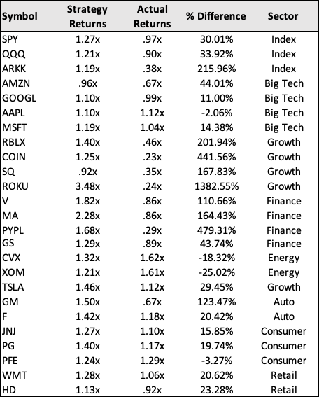

# Algorithmic Trading Bots | Machine Learning Models

This is the beta version of an algorthmic trading model. The program connects to the YFinance API and pulls price data for any ticker symbol. It utilizes a linear regression parallel channel to create buy/sell signals and applies a series of machine learning algorithms to optimize returns.

* Logistic Regression
* Random Forest Classification
* Support Vector Machine (SVM)


---

## Technologies

```python
The program uses Pandas, NumPy, Scikit-learn, pathlib, FinancialAnalysis libraries. 
```

---

## Results

The algorithmic trading model was backtested with 25 stocks and yielded promising results. A trading bot that bought a stock when its price dropped below the long-term trendline and sold it when the price rose above it outpeformed a buy/hold strategy by 141%. Thia strategy would have yielded an average return of 41% across the 25 stocks over the last year. A buy/hold strategy would've returned -12% to investors.

A major caveat is that our algorithm has the benefit of hindsight. It makes buy/sell recommendations knowing the long-term trend ahead of time. Testing this strategy in real-time over an annual period need to be done to validate the strategy.

The Logistic Regression, Random Forest Classification, and Support Vector Machine models all failed to outpeform the human-designed trading bot, but often outperformed the buy/hold strategy.




